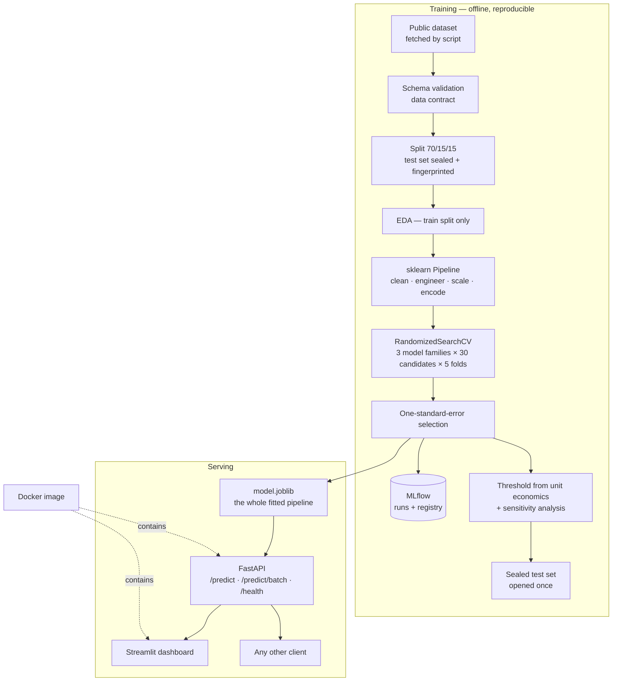

# ChurnGuard

**Customer churn prediction that optimises money, not accuracy.**

<!-- Replace YOUR-USERNAME once the repo is pushed to GitHub. -->
[](https://github.com/YOUR-USERNAME/churn-guard/actions/workflows/ci.yml)
[](https://www.python.org/downloads/)
[](https://github.com/astral-sh/ruff)

An end-to-end machine learning system: reproducible data pipeline → leakage-free
training → cost-based decisioning → explainable REST API → demo dashboard →
containerised deployment → CI.

---

## The headline

> Of the **75 highest-risk customers** the model identifies — the retention
> team's actual monthly capacity — **84% genuinely churned**, against a 26.5%
> base rate. **A 3.2× lift.**

| | |
|---|---|
| PR-AUC (sealed test set) | **0.662** |
| ROC-AUC | **0.853** |
| Recall at the operating threshold | **0.796** |
| Precision@75 | **0.840** |
| Net retention value | **$18,006 per 1,000 customers scored** |
| Lift over the existing business rule | **+46%** ($18,006 vs $12,324) |

Every figure measured **once**, on a test set sealed before any exploratory
analysis and verified unchanged by fingerprint — including the business-rule
baseline, so the comparison is like for like.

---

## Quickstart

### Docker (nothing to install but Docker)

```bash
docker compose up --build
```

* API and interactive docs → <http://localhost:8000/docs>
* Dashboard → <http://localhost:8501>

### Local

```bash
# uv manages Python and dependencies: https://docs.astral.sh/uv/
curl -LsSf https://astral.sh/uv/install.sh | sh
uv sync

# Reproduce everything from scratch — no manual downloads
uv run python -m churn_guard.data.ingest     # fetch + validate against a schema
uv run python -m churn_guard.data.split      # 70/15/15, sealed test set
uv run python -m churn_guard.eda             # analysis + figures (train only)
uv run python -m churn_guard.models.train    # tune 3 families, track in MLflow
uv run python -m churn_guard.models.evaluate # threshold, then the sealed test set
uv run python -m churn_guard.models.explain  # SHAP + fairness slices

uv run uvicorn churn_guard.api.main:app --reload   # API
uv run streamlit run streamlit_app.py              # dashboard
uv run mlflow ui --backend-store-uri sqlite:///mlflow.db   # experiment history
uv run pytest                                      # 64 tests
```

---

## The problem, framed properly

A telecom provider loses ~26.5% of its customer base annually. The retention
team currently reacts *after* a customer calls to cancel — by which point the
decision is made.

Three framing questions did more for this project than any modelling choice:

**1. What action follows a prediction?** A retention offer. If no action
existed, no accuracy would make the model worth building.

**2. What is the operational constraint?** The team can contact **500 customers
a month** out of 7,043. So the question is not *"who will churn?"* but
***"who are the 500 most worth calling?"*** — a **ranking** problem, which makes
Precision@K a first-class metric.

**3. What do mistakes cost?** Not the same amount, so the default 0.5 decision
threshold is wrong:

| | Predicted: no contact | Predicted: contact |
|---|---|---|
| **Stays** | $0 | **−$78** wasted offer |
| **Churns** | $0 | **+$156** = 0.30 × $780 − $78 |

The regret of a miss is **$156** — the intervention forgone — not the customer's
full $780 lifetime value, because an offer only succeeds 30% of the time. That
gives a **2:1** ratio and a derived threshold:

```
contact when   p × (acceptance_rate × CLV) > offer_cost
               p × (0.30 × 780)            > 78
               p                           > 0.333
```

Sweeping the validation set independently found **0.279**. Moving off 0.5 is
worth **+$2,361 per 1,000 customers** — the single highest return-per-effort
change in the project, and it involved no modelling at all.

Full write-up: [`docs/problem-definition.md`](docs/problem-definition.md).

---

## Architecture



**The load-bearing decision:** the API serves the **entire fitted `Pipeline`**,
not a bare model. It receives raw customer records and reimplements zero
preprocessing — so train/serve skew is impossible by construction rather than by
discipline.

---

## Results

Validation set used for model and threshold selection; test set opened once.

| Model | PR-AUC | ROC-AUC | Brier | Recall | P@75 | $/1,000 |
|---|---|---|---|---|---|---|
| B0 — majority class | 0.266 | 0.500 | 0.195 | 0.000 | 0.240 | $0 |
| B1 — existing business rule | 0.384 | 0.639 | 0.175 | 0.377 | 0.600 | $9,962 |
| Random forest (tuned) | 0.632 | 0.832 | 0.164 | 0.861 | 0.800 | $13,209 |
| Gradient boosting (tuned) | 0.639 | 0.836 | 0.139 | 0.701 | 0.760 | $17,711 |
| **Logistic regression (tuned)** | **0.640** | **0.835** | **0.139** | **0.765** | **0.787** | **$18,079** |

And on the sealed test set, model and current business rule scored side by side
at the same threshold:

| On the sealed test set | PR-AUC | Recall | P@75 | $/1,000 |
|---|---|---|---|---|
| B1 — existing business rule | 0.417 | 0.432 | 0.640 | $12,324 |
| **Logistic regression** | **0.662** | **0.796** | **0.840** | **$18,006** |
| | | | | **+46%** |

Note that **B0's PR-AUC of 0.266 equals the churn rate.** For PR-AUC, no-skill is
class prevalence, not 0.5 — comparing against 0.5 badly misjudges a model on
imbalanced data.

### Why the simplest model won

The three tuned families landed within **0.002 CV PR-AUC** of each other against
a fold-to-fold standard deviation of **±0.022**. That difference is noise; the
ranking would reshuffle under a different seed.

Applying the **one-standard-error rule** — among models within one standard
error of the best, take the simplest — selects logistic regression. Taking the
top number instead would have shipped the random forest, which is **worst on
business value** ($13,209 vs $18,079) and **worst calibrated** (Brier 0.164 vs
0.139), and overfits far more (train/CV gap +0.079 vs +0.009).

---

## Findings worth reading

### Simpson's paradox in the add-on services

Aggregated over all customers, churn appears to *rise* from 0 to 1 add-on, which
is nonsense:

| Add-ons | All customers | Internet customers only |
|---|---|---|
| 0 | 21.3% ⚠️ | **52.8%** |
| 1 | 44.9% | 44.9% |
| 6 | 6.2% | 6.2% |

The "0 add-ons" bucket mixes **1,074 customers with no internet at all** (7.1%
churn, structurally unable to buy add-ons) with **483 internet customers who
bought nothing** (52.8% churn — the single most at-risk group). The loyal
majority drowns out the at-risk minority and reverses the trend.

Conditioned on having internet, the relationship is clean and monotonic:
**52.8% → 6.2%**. Every add-on raises switching cost.

### Fiber optic: paying more, leaving more

| Internet | Churn |
|---|---|
| Fiber optic | **42.2%** |
| DSL | 19.0% |
| None | 7.1% |

The premium, higher-priced product has the worst retention. That is a
**price/quality problem worth escalating regardless of what the model does** —
a business finding the modelling happened to surface.

### The assumption that matters more than the model

Programme value across a plausible range of offer-acceptance rates:

| Acceptance rate | Threshold | Recall | $/1,000 |
|---|---|---|---|
| 15% | 0.721 | 0.228 | **$1,107** |
| 30% (assumed) | 0.279 | 0.765 | $18,079 |
| 50% | 0.234 | 0.811 | **$50,623** |

**The model is identical in every row.** Value swings **45×** on a number nobody
measured. The recommendation this produces is not a modelling one: *run a small
randomised pilot to measure the real acceptance rate before scaling*. That
measurement is worth more than any further tuning.

### A coefficient that flips sign

`MonthlyCharges` carries a **negative** coefficient (−0.429) while EDA shows
churners pay *more*. Both are correct — they answer different questions.
`has_internet` and `InternetService_Fiber optic` already absorb the
premium-service effect, so the residual variation in `MonthlyCharges` reflects
add-on count, which raises switching cost. **Coefficients are conditional, never
causal.**

### Fairness

| Slice | n | Base rate | Flagged | Recall | Precision | ROC-AUC |
|---|---|---|---|---|---|---|
| gender = Female | 529 | 0.270 | 0.399 | 0.797 | 0.540 | 0.850 |
| gender = Male | 528 | 0.259 | 0.405 | 0.796 | 0.509 | 0.858 |
| SeniorCitizen = 0 | 888 | 0.231 | 0.349 | 0.751 | 0.497 | 0.857 |
| SeniorCitizen = 1 | 169 | 0.444 | 0.680 | 0.920 | 0.600 | **0.774** |

**Gender: clean parity** — recall 0.797 vs 0.796. We could only verify this
because `gender` was deliberately retained despite carrying no predictive signal
(0.7pp spread).

**Seniors** are flagged at 68% vs 35%, but their base churn rate is also roughly
double (44% vs 23%), and **both recall and precision are higher** for them — they
are contacted more because they leave more, and the targeting is *more* accurate.
The genuine issue is **ranking quality** (ROC-AUC 0.774 vs 0.857) on a slice of
only 169 customers, so it is flagged for monitoring rather than treated as bias.

Demographic parity, equal opportunity and predictive parity **cannot all hold
simultaneously** when base rates differ — a proven impossibility, not a modelling
failure. This project prioritises **equal opportunity** (equal recall), so
everyone at risk gets a fair chance of being saved.

---

## Leakage prevention

The test set is split **before** any exploratory analysis, cleaning, imputation
or scaling — and never touched again until the final evaluation.

This is not caution for its own sake. Measured on this dataset, balancing classes
*before* splitting (a very common student shortcut) puts **713 customers on both
sides**, so 43% of the "unseen" test set has already been memorised:

| | ROC-AUC | PR-AUC |
|---|---|---|
| Balance → split (what you would report) | 0.9571 | 0.9547 |
| Split → balance train only (the truth) | 0.8102 | 0.5948 |
| **Inflation** | **+18%** | **+61%** |

You would publish a PR-AUC of 0.95 for a model worth 0.59, and nothing would look
wrong. **Leakage lies upward**, which is why it survives review — a bug that
worsens your score gets investigated; one that improves it gets celebrated.

Four structural defences:

1. **Split first**, immediately after schema validation
2. **All preprocessing inside a `Pipeline`**, so stateful steps are fitted per CV fold
3. **Test-set fingerprint** recorded at split time and reverified before evaluation
4. **A test that fails on leakage** — comparing the scaler's learned statistics
   against the training split's own, verified by mutation testing to fail when
   the pipeline is fitted on train+val

---

## Project structure

```
├── configs/config.yaml        every tunable value; nothing hardcoded
├── data/                      gitignored — regenerated by the ingest script
├── docs/
│   ├── problem-definition.md  framing, cost model, acceptance criteria
│   └── eda-findings.md        each finding paired with the decision it drove
├── src/churn_guard/
│   ├── config.py              typed config, paths resolved to the project root
│   ├── logger.py              console at INFO, rotating file at DEBUG
│   ├── exception.py           typed error hierarchy
│   ├── eda.py                 analysis + figures, training split only
│   ├── data/                  ingest (with data contract) · split (sealed)
│   ├── features/build.py      all 10 EDA decisions as sklearn transformers
│   ├── models/                metrics · baselines · train · evaluate · explain
│   └── api/                   schemas (Pydantic) · service · FastAPI app
├── tests/                     64 tests
├── streamlit_app.py           demo dashboard
├── Dockerfile                 multi-stage, non-root
└── .github/workflows/ci.yml   lint → pipeline → tests → image → smoke test
```

---

## Reproducibility

Every result regenerates from this repository alone. Verified by deleting
`models/` and `data/` entirely and re-running the pipeline:

```
Test seal verified: fingerprint 9ee2405ba4ee2531 unchanged since Day 1
Selected: logistic_regression (CV PR-AUC 0.6661)
PR-AUC 0.662 PASS   ROC-AUC 0.853 PASS   Recall 0.796 PASS
```

Identical fingerprint, identical model, identical metrics.

* **`uv.lock`** pins all ~180 transitive dependencies to exact versions
* **One seed** (`configs/config.yaml`) governs splitting, model init and CV shuffling
* **Data acquisition is a script**, so nothing depends on a manual download
* **CI runs the whole pipeline from a clean checkout**, so any dependency on a
  file that exists only on a developer's machine fails there first

---

## Honest limitations

**The dataset is a snapshot with no timestamps.** A true forward-looking
prediction window cannot be constructed or validated here, so this is a *current
risk score*, not a "will churn in the next 30 days" prediction. Production would
need point-in-time correct features and a **time-based** split — a random split
on temporal data leaks the future into the past.

**The cost assumptions are estimates.** Only average monthly revenue ($64.76) is
measured; CLV horizon, offer cost and acceptance rate are business assumptions.
The sensitivity table above shows how much rides on the last one.

**The test score is a point estimate.** PR-AUC 0.662 on 1,057 rows with a CV
standard deviation of ±0.022 is honestly reported as **≈0.65 ± 0.02**. Test
scoring higher than validation (0.662 vs 0.640) is split-to-split variation, not
improvement — both metrics are threshold-independent, so the threshold change
could not have moved them.

**Small slices are noisy.** The senior-citizen fairness gap rests on 169
customers.

## What production would add

| Gap | What it needs |
|---|---|
| Point-in-time features | A feature store (Feast/Tecton) with time-travel joins |
| Scheduled retraining | Airflow or Dagster, triggered on drift |
| Drift monitoring | Input/prediction distribution tracking with alerting |
| Proven business lift | A/B test against the existing rule — offline metrics only predict it |
| True acceptance rate | A randomised pilot; the single highest-value measurement available |
| Shadow deployment | Run alongside the current process before switching |

## Stack

Python 3.12 · uv · scikit-learn · pandas · MLflow · SHAP · FastAPI · Pydantic ·
Streamlit · Docker · pytest · ruff · GitHub Actions

## Data

[IBM Telco Customer Churn](https://www.kaggle.com/datasets/blastchar/telco-customer-churn)
— 7,043 customers, 21 columns, publicly available sample dataset. Downloaded
automatically by `churn_guard.data.ingest`.

## License

MIT
